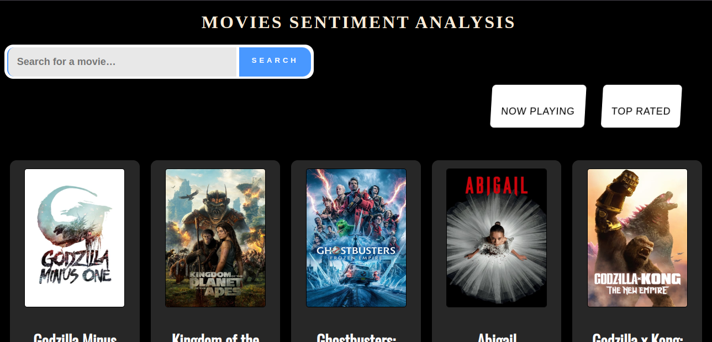
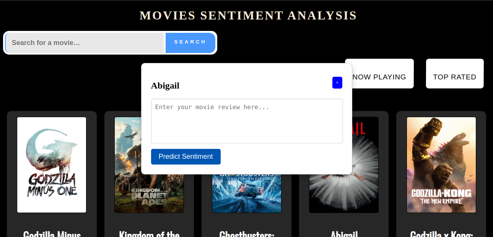
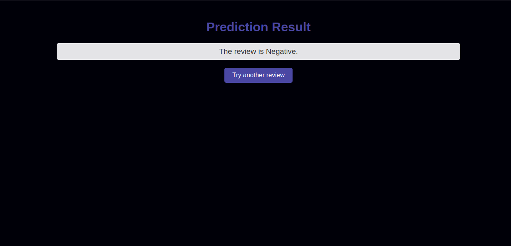

# Title :

SentimentCine: Movie Review Sentiment Analyzer

# Description :

SentimentCine is an engaging web application crafted to analyze the emotional content of movie reviews. Developed using Flask and JavaScript, and powered by advanced natural language processing techniques, this app processes user-submitted reviews to quickly determine their sentiment as positive or negative. With its intuitive interface and immediate feedback, SentimentCine is perfect for movie buffs, critics, and anyone interested in the nuanced sentiments of film reviews.

# Technologies Used :

- Flask: A lightweight WSGI web application framework used to serve the application and handle requests.
- JavaScript: Enhances user interactions and dynamically updates content on the client side.
- Natural Language Processing (NLP): Utilizes libraries to analyze text and extract sentiment.
- HTML/CSS: Structures and styles the web interface.
- Pickle: Manages loading the pre-trained machine learning models for sentiment analysis.

# Features :

- Real-time Sentiment Analysis: Offers immediate feedback on the emotional tone of a review
- Distinguishing between positive and negative sentiments.
- Intuitive Interface: Allows users to easily submit reviews and view sentiment analysis results.

## Application Screenshots

### Main Upload Page
Here's where users can visualise the list of movies with search functionnality

### Results Page
when a movie is clicked you can enter a review for emotion analysis:

---

---

